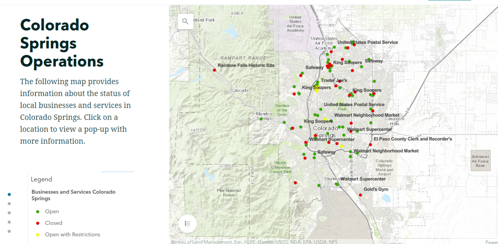

#  Garret's GIS Project Portfolio 
I am a student at Colorado Mountain College concentrating in Natural Resource Management and Geographic Information Systems. I believe deeply in the power of data driven technologies to enhance the way we think and how we visualize the world around us. As a Natural Resource Management student, I am thoroughly convinced geospatial technologies in conjunction with other methods can help us solve many of the environmental problems we experience in our world today.  
## Covid - 19 in Colorado Springs, Co Story Map
The following story map was created for residents of Colorado Springs, Co to serve as a resource during the Covid- 19 pandemic. It displays information about the status of local businesses and services including testing sites, grocery stores hours and local food pantries. The latter portion of the project depicts real time data regarding Covid - 19 cases in Colorado Counties.  

(https://storymaps.arcgis.com/stories/dd95179d1307443792725e56c4dff62a) 
